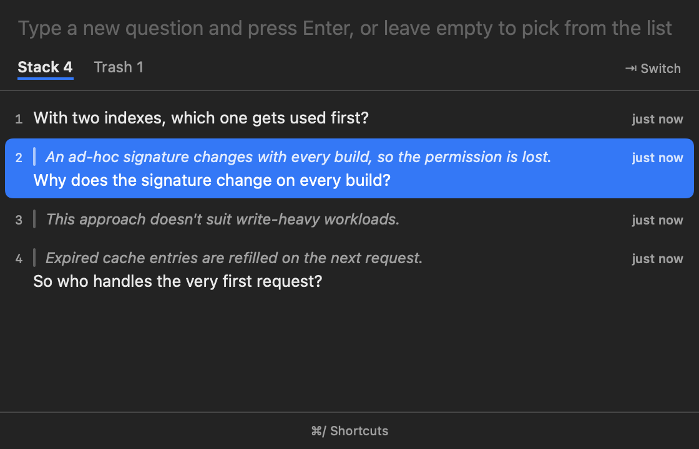
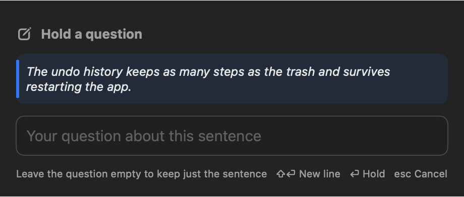
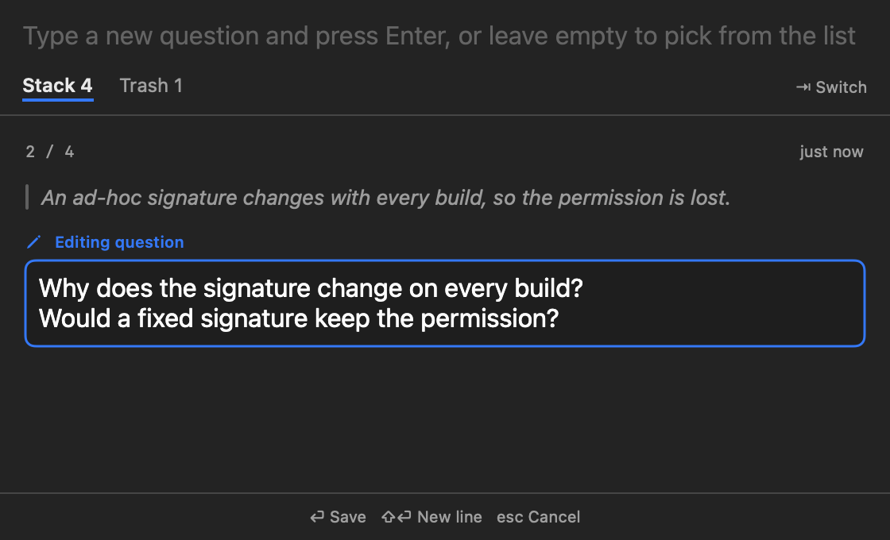

<p align="center"></p>

# HoldStack

<p align="center"><a href="README.md">한국어</a> | English</p>

When you talk with an AI or read through a document, questions and fixes pile up all at once. Handle them together and things get messy; handle them one at a time and you forget the rest. HoldStack is a macOS menu bar app that holds them for a moment, along with the sentence that raised them, and lets you take them out one by one.

It borrows the hold feature from Tetris, except it keeps a whole stack instead of a single slot. Like a clipboard manager, its shortcuts work in any app, so it behaves the same in the terminal, the browser, and everywhere else.

The app speaks English and Korean and follows your system language by default.

<p align="center"></p>

| About | How to use | Reference |
|---|---|---|
| [Isn't the clipboard enough?](#isnt-the-clipboard-enough) | [Getting started](#getting-started) | [Keys](#keys) |
| [An example](#an-example) | [Holding a question](#holding-a-question) | [Settings](#settings) |
|  | [Taking one out](#taking-one-out) |  |
|  | [Editing](#editing) |  |
|  | [Trash and undo](#trash-and-undo) |  |

## Isn't the clipboard enough?

You might wonder why not just copy things to the clipboard, or use a clipboard manager. That was the first question I asked myself too.

The clipboard has one slot, so the next copy overwrites it. Talking with an AI means copying code and commands constantly, and a question left there disappears fast. A clipboard manager keeps a history, but that history mixes in everything you copied. You end up digging through commands, links, and code snippets to find the questions you haven't asked yet.

I came to think a question is a different kind of thing from copied text. It only makes sense together with the sentence it came from, and it is done once you ask it. So HoldStack keeps questions and their sentences apart from your copy history. Taking one out removes it from the list, so whatever is left is exactly what you haven't asked yet.

## An example

An AI explaining caching says "expired entries are refilled on the next request." That makes you wonder who handles the very first request, but you are in the middle of asking something else. Select that sentence, press `⌃⇧H`, and jot down your question. When you get your answer, open the list with `⌃⇧L` and press Enter. The held sentence and your question land in the input box, ready to send.

## Getting started

HoldStack runs on macOS 14 or later, on both Intel and Apple Silicon Macs. Download `HoldStack-<version>.zip` from [Releases](../../releases/latest), unzip it, move `HoldStack.app` to your Applications folder, and open it. The app is not signed with a developer certificate or notarized by Apple, so macOS blocks it the first time. Notarization is Apple's check that an app is safe. After it is blocked once, go to System Settings → Privacy & Security and click "Open Anyway."

On first launch it asks for Accessibility permission, which lets an app press keys on your behalf. HoldStack uses it to copy the selected sentence and to paste the question you take out. Without it, the shortcuts and the list still work, but a question you take out only reaches the clipboard, so you press `⌘V` yourself.

## Holding a question

<p align="center"></p>

Select the sentence that caught your eye and press `⌃⇧H` to open the compose window. The held sentence sits on top, with a box for your question below. Type your question and press Enter, and the sentence and question are stacked as one entry and the window closes. Press `⇧⏎` for a new line.

If nothing is selected you write just a question, and if you leave the question empty the sentence alone is kept. `esc` closes without saving. If you click another app while writing, the window steps aside but keeps what you typed, and `⌃⇧H` picks up where you left off.

## Taking one out

Press `⌃⇧L` to open the list window. Each entry shows the held sentence dimmed on the first line and your question below it. Press Enter on an entry, or click it, and it is pasted into the input box of the app you were just using, like this:

```
"the held sentence"

your question
```

HoldStack only pastes into text fields. If you last clicked a web page body or a Finder window, you hear a beep and the question stays in the list; click an input box and pick it again. To paste the top question without opening the list, press `⌃⇧P`.

Press `→` to read a long question in full. The list steps aside and that question fills the window; `↑` `↓` move to the previous and next ones, and `←` brings the list back. You can also type a new question in the box at the top of the list window and press Enter to stack it.

## Editing

<p align="center"></p>

To polish a question, select it in the list and press `⌘E`. Right where you were looking, the question turns into a bordered input box marked "Editing question". Press Enter and the edited question appears in place; `esc` cancels just the edit. The held sentence is a quote from the original, so it can't be edited.

## Trash and undo

Questions you take out or delete go to the Trash instead of disappearing. The trash keeps the latest 10 and drops the oldest when it overflows. Press `⇥` or click Trash to see it, and press Enter there to put a question back on top of the stack.

`⌘Z` undoes your actions one at a time, starting from the latest: taking out, deleting, editing, and anything done in the trash. Clearing everything comes back in one step. The undo history keeps as many steps as the trash does and survives restarting the app.

## Keys

Press `⌘/` in the list window to see all of these on one card.

| Shortcut (anywhere) | What it does |
|---|---|
| `⌃⇧H` | Holds the selected sentence and opens the compose window |
| `⌃⇧L` | Opens or closes the list window |
| `⌃⇧P` | Pastes the top question right away |

| Keys in the list window | What they do |
|---|---|
| `↑` `↓` | Move between questions |
| `→` `←` | Show the selected question in full, then go back to the list |
| `⏎` | Paste the selected question. In the trash, put it back on the stack |
| `⌘E` | Edit the selected question |
| `⌫` | Move the selected question to the trash. In the trash, delete it |
| `⇥` | Switch between the stack and the trash |
| `⌘Z` | Undo the last action |
| `⌘,` | Open settings |
| `esc` | Leave the full view or the edit. Otherwise close the window |

## Settings

Press `⌘,` in the list window, or choose Settings… from the menu bar icon. Values in parentheses are the defaults on a fresh install.

| Setting | What it does |
|---|---|
| Language (follow system) | Pin the app to English or 한국어. It shows English unless your system language is Korean |
| Launch at login (off) | Adds HoldStack to your login items. You may need to allow it in System Settings → General → Login Items the first time |
| Show count in menu bar (on) | Shows or hides the number next to the icon |
| Opacity (95%) | Lets the list window show through, from 30% to 100% |
| Items kept in Trash (10) | Type a number from 5 to 50. The undo history follows the same number, and lowering it doesn't delete anything right away |
| Close after pasting (on) | Turn off to keep the list window open after pasting |
| Paste only into text fields (on) | Turn off to paste wherever the focus is |
| Close when another app is clicked (on) | Turn off to keep the window up while you use other apps |
| Close on desktop switch (on) | Turn off to have the window follow you across desktops |
| When expanding with → (Show full view) | Switch to "Expand in place" to grow just that row instead of covering the list |
| Font size (Held sentence 12pt, Your question 13pt) | Set the held sentence and your question separately, from 10pt to 24pt |
| Global shortcuts | Click a button and press a new combination to change it. Turn one off with the switch next to it to free that combination for other apps |

A shortcut must include `⌃`, `⌥`, or `⌘`, and editing shortcuts every app relies on, such as `⌘C` and `⌘V`, can't be chosen.
