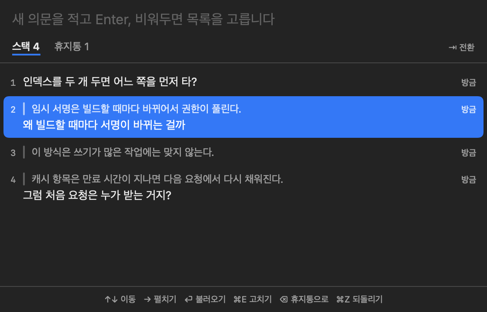
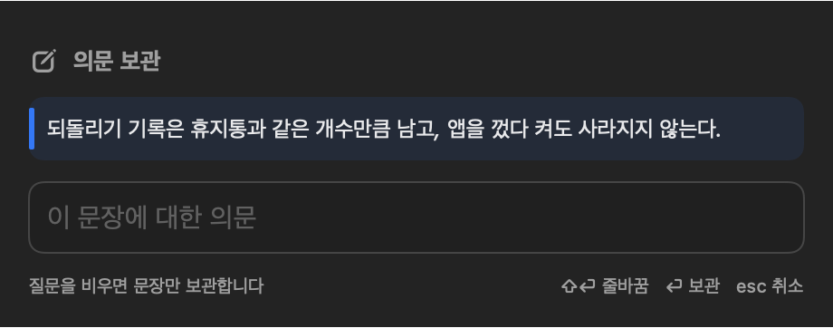
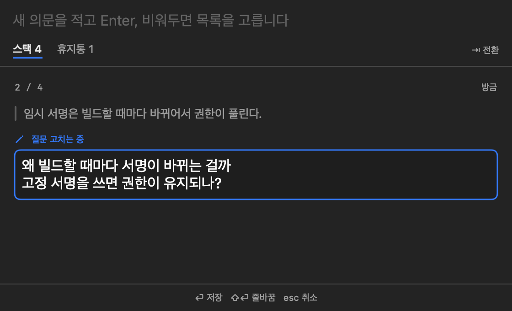

<p align="center"></p>

# HoldStack

AI 와 대화하거나 문서를 읽다 보면 묻고 싶은 것과 고치고 싶은 것이 한꺼번에 여러 개 생긴다. 한 번에 다루면 어지럽고, 하나씩 다루면 나머지를 잊는다. HoldStack 은 그것들을 걸린 문장과 함께 잠시 쌓아 두었다가 하나씩 꺼내 쓰게 해 주는 macOS 메뉴 막대 앱이다.

테트리스의 홀드 기능을 차용하되, 한 칸이 아니라 여러 개를 쌓아 둘 수 있게 했다. 클립보드 관리자처럼 어느 앱에서든 단축키가 먹으므로 터미널과 브라우저 등 어디서나 똑같이 쓴다.

<p align="center"></p>

| 소개 | 쓰는 법 | 참고 |
|---|---|---|
| [클립보드로 충분하지 않은가](#클립보드로-충분하지-않은가) | [시작하기](#시작하기) | [키](#키) |
| [이렇게 쓴다](#이렇게-쓴다) | [의문 보관하기](#의문-보관하기) | [설정](#설정) |
|  | [꺼내서 묻기](#꺼내서-묻기) |  |
|  | [고치기](#고치기) |  |
|  | [휴지통과 되돌리기](#휴지통과-되돌리기) |  |

## 클립보드로 충분하지 않은가

클립보드에 복사해 두거나 클립보드 관리자를 쓰면 되지 않느냐는 의문이 들 수 있다. 만들면서 가장 먼저 한 고민도 그것이었다.

클립보드는 한 칸이라 다음에 무언가를 복사하는 순간 덮인다. AI 와 대화하다 보면 코드와 명령어를 계속 복사하게 되니, 의문을 거기 두면 금방 사라진다. 클립보드 관리자는 기록을 남겨 주지만 그 기록에는 복사한 모든 것이 섞인다. 명령어와 링크, 코드 조각 사이에서 아직 묻지 않은 의문을 다시 골라내야 한다.

의문은 복사한 글과 성격이 다르다고 생각했다. 어느 문장에서 생겼는지가 함께 있어야 뜻이 통하고, 물어보고 나면 끝나는 일이다. 그래서 복사 기록과 떼어 놓고, 의문과 그 문장만 모아 두는 곳을 따로 만들었다. 꺼내면 목록에서 빠지므로 남아 있는 것이 곧 아직 묻지 않은 의문이다.

## 이렇게 쓴다

AI 가 캐시 동작을 설명하다가 "만료된 항목은 다음 요청에서 다시 채워진다"고 말했다. 이 문장에서 "그럼 처음 요청은 누가 받지?"가 궁금해졌지만, 지금은 다른 걸 묻는 중이다. 그 문장을 선택하고 `⌃⇧H` 를 누른 뒤 궁금한 점을 적어 둔다. 하던 질문을 마저 하고 답을 받으면 `⌃⇧L` 로 목록을 열어 Enter 를 누른다. 붙잡아 둔 문장과 질문이 입력칸에 들어가니 그대로 보내면 된다.

## 시작하기

macOS 14 이상에서 동작한다. 받은 `HoldStack.app` 을 응용 프로그램 폴더에 넣고 연다. 개발자 인증서로 서명하고 Apple 공증(notarization)을 받은 앱이 아니어서 처음에는 macOS 가 막는다. 공증은 Apple 이 앱을 검사하고 문제없다고 확인해 주는 절차다. 한 번 열어 막힌 뒤 시스템 설정 → 개인정보 보호 및 보안에서 「그래도 열기」를 누르면 된다.

처음 실행하면 손쉬운 사용(Accessibility) 권한을 묻는다. 다른 앱을 대신해 키를 눌러 주는 권한이다. HoldStack 은 이 권한으로 선택한 문장을 복사하고 꺼낸 의문을 붙여넣는다. 허용하지 않아도 단축키와 목록은 쓸 수 있지만, 꺼낸 의문이 클립보드에 들어가는 데서 멈추므로 `⌘V` 를 직접 눌러야 한다.

## 의문 보관하기

<p align="center"></p>

AI 의 답변에서 걸리는 문장을 선택하고 `⌃⇧H` 를 누르면 작성 창이 뜬다. 위에는 붙잡은 문장이, 아래에는 질문을 적는 칸이 있다. 질문을 적고 Enter 를 누르면 문장과 질문이 한 항목으로 쌓이고 창이 닫힌다. 줄을 바꾸려면 `⇧⏎` 를 누른다.

문장을 선택하지 않고 누르면 질문만 적게 되고, 질문을 비운 채 Enter 를 누르면 문장만 보관된다. `esc` 는 보관하지 않고 닫는다. 쓰는 도중에 다른 앱을 눌러 창이 내려가도 쓰던 내용은 남아 있어서, 다시 `⌃⇧H` 를 누르면 이어서 쓴다.

## 꺼내서 묻기

`⌃⇧L` 을 누르면 목록 창이 뜬다. 항목마다 윗줄에 붙잡은 문장이 흐리게, 그 아래에 나의 질문이 보인다. 고른 줄에서 Enter 를 누르거나 줄을 클릭하면 그 의문이 방금까지 쓰던 앱의 입력칸에 이런 모양으로 들어간다.

```
"붙잡은 문장"

나의 질문
```

입력칸이 아닌 곳에는 붙여넣지 않는다. 웹페이지 본문이나 Finder 를 클릭해 둔 상태라면 경고음만 나고 의문은 목록에 그대로 남으니, 입력칸을 클릭한 뒤 다시 고르면 된다. 목록을 열지 않고 맨 위 의문을 곧장 붙여넣으려면 `⌃⇧P` 를 누른다.

긴 의문은 `→` 로 크게 본다. 목록이 가려지고 그 의문만 창 가득 보이며, `↑` `↓` 로 앞뒤 의문을 넘기고 `←` 로 목록에 돌아온다. 목록 창 맨 위 입력칸에 새 의문을 적어 Enter 를 눌러도 바로 쌓인다.

## 고치기

<p align="center"></p>

적어 둔 질문을 다듬고 싶으면 목록에서 그 의문을 고르고 `⌘E` 를 누른다. 보고 있던 자리에서 질문이 테두리 친 입력칸으로 바뀌고 「질문 고치는 중」 표시가 붙는다. 고친 뒤 Enter 를 누르면 그 자리에 고친 질문이 보이고, `esc` 는 고치기만 취소한다. 붙잡은 문장은 원문 인용이라 고칠 수 없다.

## 휴지통과 되돌리기

꺼내거나 지운 의문은 바로 사라지지 않고 휴지통에 들어간다. 휴지통은 최근 10개까지 보관하고, 넘치면 가장 오래된 것부터 빠진다. `⇥` 를 누르거나 「휴지통」 글자를 클릭하면 휴지통 목록이 보이고, 거기서 Enter 를 누르면 그 의문이 스택 맨 위로 돌아온다.

`⌘Z` 는 마지막 동작부터 하나씩 되돌린다. 꺼내기와 지우기, 고치기, 휴지통에서 한 일이 모두 대상이고, 전체 비우기는 한 번에 통째로 돌아온다. 되돌리기 기록은 휴지통과 같은 개수만큼 남고 앱을 껐다 켜도 사라지지 않는다.

## 키

| 단축키 (어디서든) | 하는 일 |
|---|---|
| `⌃⇧H` | 선택한 문장을 붙잡고 작성 창을 연다 |
| `⌃⇧L` | 목록 창을 열고 닫는다 |
| `⌃⇧P` | 맨 위 의문을 곧장 붙여넣는다 |

| 목록 창 안의 키 | 하는 일 |
|---|---|
| `↑` `↓` | 의문 사이를 오간다 |
| `→` `←` | 고른 의문을 크게 보고, 목록으로 돌아온다 |
| `⏎` | 고른 의문을 붙여넣는다. 휴지통에서는 스택으로 되돌린다 |
| `⌘E` | 고른 의문의 질문을 고친다 |
| `⌫` | 고른 의문을 휴지통으로 보낸다. 휴지통에서는 지운다 |
| `⇥` | 스택과 휴지통을 오간다 |
| `⌘Z` | 마지막 동작을 되돌린다 |
| `⌘,` | 설정 창을 연다 |
| `esc` | 크게 보기나 고치기를 끝낸다. 둘 다 아니면 창을 닫는다 |

## 설정

목록 창에서 `⌘,` 를 누르거나 메뉴 막대 아이콘의 「설정…」을 고르면 열린다. 괄호 안은 처음 설치했을 때의 값이다.

| 항목 | 내용 |
|---|---|
| 로그인할 때 자동으로 실행 (꺼짐) | macOS 로그인 항목에 등록한다. 처음에는 시스템 설정 → 일반 → 로그인 항목에서 허용해야 할 수 있다 |
| 메뉴 막대에 보관 개수 표시 (켜짐) | 아이콘 옆 숫자를 보이거나 숨긴다 |
| 투명도 (95%) | 목록 창을 30% 에서 100% 사이로 비치게 한다 |
| 휴지통에 둘 개수 (10개) | 5개에서 50개 사이로 적는다. 되돌리기 기록도 같은 개수를 따르고, 줄여도 바로 지우지 않는다 |
| 불러온 뒤 창 닫기 (켜짐) | 끄면 붙여넣은 뒤에도 목록 창이 남는다 |
| 입력칸이 아니면 붙여넣지 않기 (켜짐) | 끄면 초점이 어디에 있든 붙여넣는다 |
| 다른 앱을 누르면 창 닫기 (켜짐) | 끄면 다른 앱을 눌러도 창이 떠 있다 |
| 데스크탑을 옮기면 창 닫기 (켜짐) | 끄면 창이 모든 데스크탑을 따라다닌다 |
| → 로 펼칠 때 (내용만 크게 보기) | 「그 자리에서 펼치기」로 바꾸면 목록을 가리지 않고 그 줄만 커진다 |
| 글자 크기 (문장 12pt, 질문 13pt) | 붙잡은 문장과 나의 질문을 10pt 에서 24pt 사이로 따로 정한다 |
| 전역 단축키 | 버튼을 누르고 새 조합을 누르면 바뀐다. 옆 스위치로 끄면 그 조합을 다른 앱이 쓸 수 있다 |

단축키 조합에는 `⌃` 나 `⌥`, `⌘` 중 하나가 들어가야 하고, `⌘C` 나 `⌘V` 처럼 모든 앱이 쓰는 편집 단축키는 고를 수 없다.
